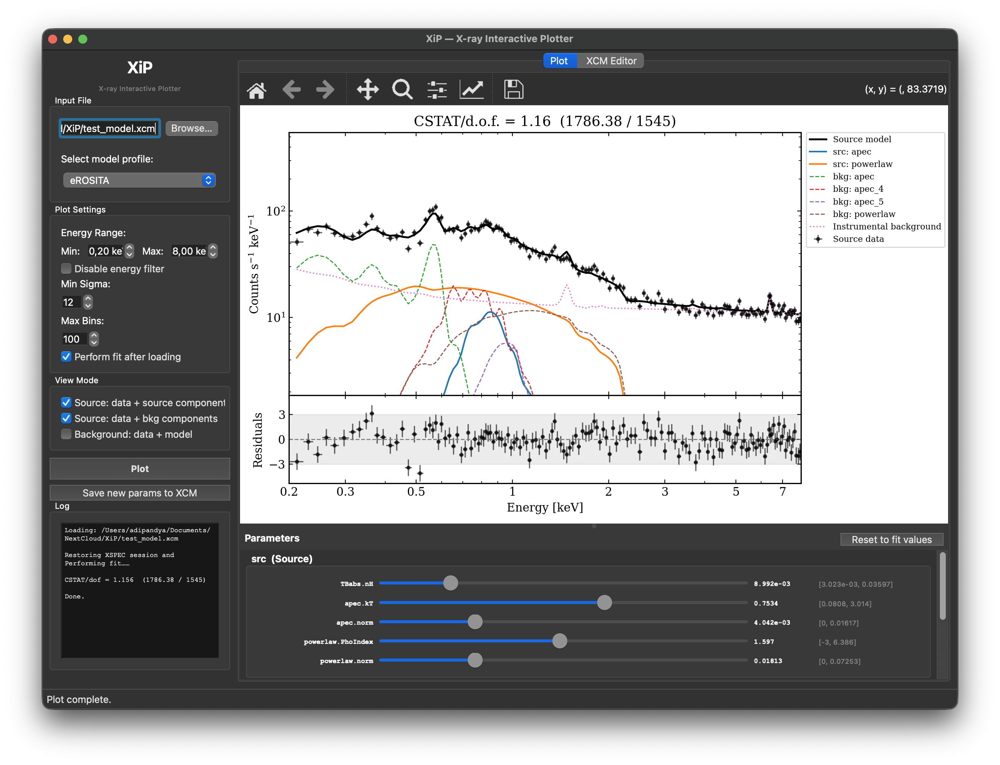
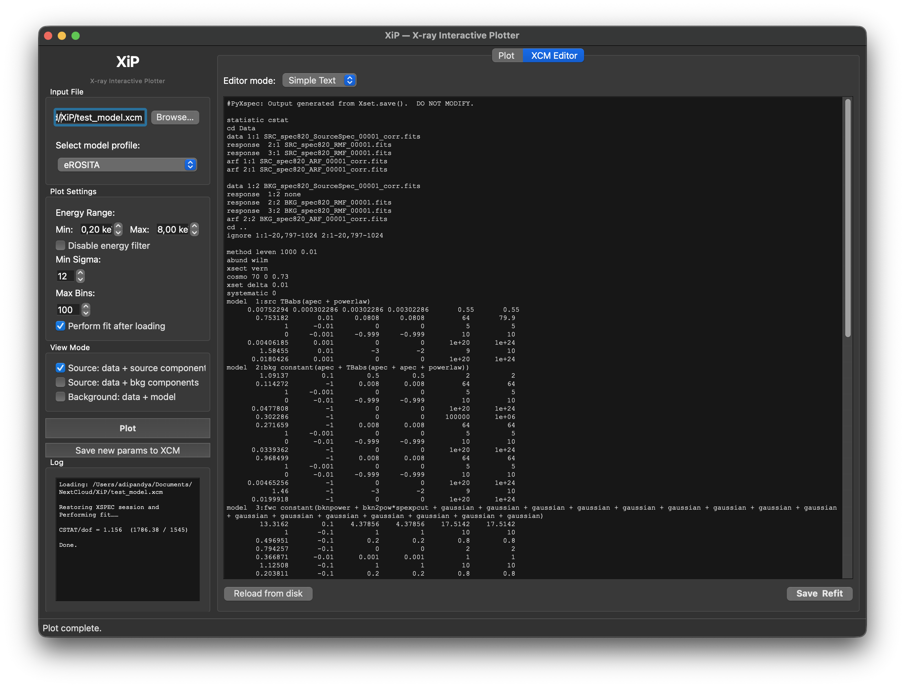
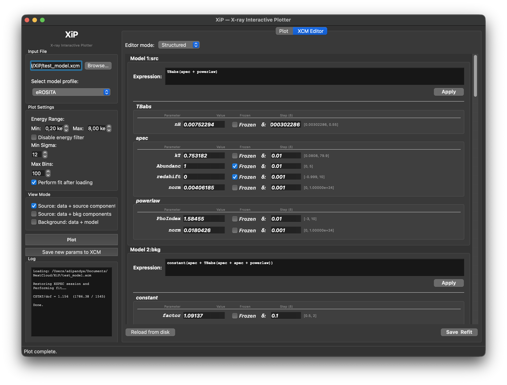

# XiP — X-ray Interactive Plotter
**By Aditya Pandya**

Desktop GUI for loading, fitting, and interactively inspecting X-ray spectral models produced by [XSPEC](https://heasarc.gsfc.nasa.gov/xanadu/xspec/). Takes an XSPEC `.xcm` session file as input and provides a PyQt6 interface for visualising spectra, residuals, and individual model components.



## Features

- Load any `.xcm` session file; run or skip a fit in a background thread
- Interactive plot: source/background spectra, total model curve, and per-component curves
- Profile system: **eROSITA** (3-model layout) and **Default** (any single- or dual-spectrum setup), with auto-detection and easy extensibility
- Real-time parameter sliders — tweak any free XSPEC parameter and see the plot update live
- Built-in XCM editor — structured form or raw text, with **Save & Refit** in one click

 


## Requirements

| Package | Notes |
|---------|-------|
| Python ≥ 3.10 | |
| [PyXSPEC](https://heasarc.gsfc.nasa.gov/xanadu/xspec/python/html/) | Bundled with HEASoft |
| PyQt6 | GUI framework |
| matplotlib | Plotting |
| numpy | Numerical arrays |

```bash
pip install -r requirements.txt
```

## Installation

```bash
git clone <repo-url>
cd XiP
pip install -e .
```

The `-e` flag installs in editable mode — file changes take effect immediately without reinstalling.

## Usage

### Launch the GUI

```bash
xip-gui
# or
python XiP_GUI.py
```

1. **Browse…** — select a `.xcm` session file
2. Set energy range, binning, and fit options in the sidebar
3. **Plot** — XSPEC loads and fits in a background thread
4. Toggle view modes with the **View Mode** checkboxes
5. Drag **Parameter** sliders for live model exploration
6. Switch to the **XCM Editor** tab to edit parameters and **Save & Refit**

## Repository structure

```
XiP/
├── XiP_GUI.py                 # Entry point — run directly or via `xip-gui`
│
├── xip/                       # Internal package
│   ├── backend.py             # XSPEC session management, fitting, component extraction
│   ├── plotting.py            # Shared matplotlib rendering logic
│   ├── xcm_editor.py          # XCM parser, serialiser, and structured Qt editor widget
│   ├── xspec_model_db.json    # XSPEC component names and default parameter values
│   └── profiles/              # View profile plugins and add new ones by dropping in a new .py file
│       ├── base.py            # Abstract base class (XiPProfile)
│       ├── default.py         # Default profile (1–2 model setups)
│       └── erosita.py         # eROSITA profile (3-model: src, astro-bkg, inst-bkg)
│
├── Data/                      # Example eROSITA spectra (FITS) and FWC XCM files
│
├── XiP_Notebook/              # Standalone Jupyter notebook version (Old implementation)
│   ├── XiP.py
│   ├── XiP_demo.ipynb
│   └── utils.py
│
├── pyproject.toml
└── requirements.txt
```

## Adding a custom profile

Create a new `.py` file in `xip/profiles/` with a module-level `PROFILE` instance:

```python
from xip.profiles.base import XiPProfile

class MyProfile(XiPProfile):
    name = "My Instrument"
    modes = [(1, "Source components"), (3, "Background components")]
    default_modes = {1}

    def detect(self, model_kind_map):
        return "inst_bkg" not in model_kind_map  # auto-select condition

    def render_components(self, ax, component_curves, spec_lookup, modes, kind_styles):
        ...  # draw curves onto ax

PROFILE = MyProfile()
```

It will be discovered and listed in the GUI automatically — no registration needed.

## Notes

- XSPEC is configured to `vern` cross-sections, `wilm` abundances, and C-statistic by default. Override in `xip/backend.py` → `_configure_xspec()`.
- The eROSITA profile expects three model sources: (1) source emission, (2) astrophysical background, (3) instrumental background.
- `cd` directives in XCM files are handled automatically — data paths are resolved to absolute paths before loading.

## Contributing
Contributions are welcome! Please submit a pull request or open an issue for any bugs or feature requests.

## Author's Note
This tool was built because I found it difficult to visualize the effects of different XSPEC models and their parameters. The original Jupyter-based prototype in [XiP_Notebook](XiP_Notebook) is my own work; the desktop GUI was developed with the assistance of Claude AI (Sonnet 4.6).  

I hope you find it useful for your spectral analysis needs. If you have any suggestions for improvements or new features, please feel free to reach out at my email id: aditya.pandya@astro.uni-tuebingen.de.

#### Disclaimer 
This tool is a work in progress and may have bugs or limitations. Please report any issues you encounter, and feel free to suggest improvements or new features.
